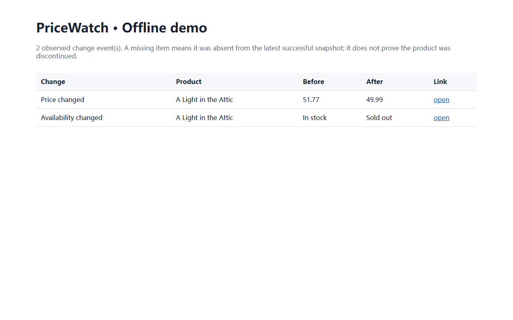

# PriceWatch · Competitor price snapshot differences

This repository is an MIT-licensed extension/adaptation of
https://github.com/kwattakoning/web-scraper. The original license and pinned
source record are retained. This repository is a directly published code
snapshot rather than a fork. The extension was developed with Codex assistance.

The upstream project already scraped configurable product listings into a
timestamped CSV. PriceWatch adds atomic SQLite snapshots separated by source,
stable product keys, added/removed/price/availability change events, an
escaped local HTML report, and command-line database/report options.

Example command:

    python -m price_scraper -c config.yaml --database outputs/history.db --report outputs/latest-changes.html

The first snapshot reports every observed item as added. Later successful runs
compare against the previous snapshot from the same configured site.
“Removed” means absent from the latest successful snapshot; it does not prove
the product was discontinued. Respect each target site's terms, robots policy,
rate limits, and applicable law.

Offline demo, using synthetic fixture HTML without a web request:

    python scripts/demo_history.py

Tests:

    python -m pytest -q

Verified locally on Windows with Python 3.12: 27 tests passed. See UPSTREAM.md
for attribution. No customer, revenue, live alert, or production-scale claim
is made.



# Upstream README: Competitor Price Scraper


A small, **configurable** web scraper that collects product names and prices from a
shop's listing pages and appends a **dated snapshot** to a CSV — so running it daily
builds a price history you can chart or diff against competitors.

Built with `requests` + `BeautifulSoup`. The target site and the CSS selectors live in a
YAML config, so **the same code works on any shop** — you only edit `config.yaml`, never
the Python.

> The demo config targets [books.toscrape.com](https://books.toscrape.com), a public
> sandbox made for practising scraping (stable, and explicitly OK to scrape).

---

## Features

- 🧩 **Config-driven** — point it at any shop via CSS selectors in `config.yaml`, no code changes.
- 📄 **Pagination** — follows "next page" links up to a configurable safety cap.
- 💷 **Robust price parsing** — handles `£51.77`, `$1,234.50`, `1.234,50`, etc.
- 🗓️ **Price history** — every run appends rows stamped with `scraped_at`.
- 📊 **Excel-friendly CSV** — UTF-8 BOM so currency symbols render correctly on double-click.
- 🤝 **Polite by default** — sets a User-Agent and pauses between requests.
- ✅ **Tested** — 23 unit tests; parsing/pagination are tested offline (no network).

## Example output

```csv
scraped_at,name,price,currency,availability,url
2026-05-24 18:14:33,A Light in the Attic,51.77,£,In stock,https://books.toscrape.com/catalogue/a-light-in-the-attic_1000/index.html
2026-05-24 18:14:33,Tipping the Velvet,53.74,£,In stock,https://books.toscrape.com/catalogue/tipping-the-velvet_999/index.html
```

## Project structure

```
web-scraper/
├── price_scraper/
│   ├── config.py      # load + validate the YAML config
│   ├── scraper.py     # fetch, parse, price-normalise, paginate
│   ├── storage.py     # append dated rows to CSV
│   └── cli.py         # command-line interface
├── tests/             # 23 pytest tests (offline fixtures)
├── config.yaml        # demo config (books.toscrape.com)
├── requirements.txt
└── pyproject.toml
```

## Installation

```bash
# 1. create + activate a virtual environment
python -m venv .venv
# Windows:  .venv\Scripts\activate
# macOS/Linux:  source .venv/bin/activate

# 2. install dependencies
pip install -r requirements.txt
# (or, to get the `price-scraper` command:  pip install -e .)
```

## Usage

```bash
# scrape using the demo config and append to prices.csv
python -m price_scraper

# custom config + output, limit to 5 pages
python -m price_scraper --config my_shop.yaml --output my_shop.csv --max-pages 5
```

| Flag | Description |
|------|-------------|
| `-c, --config` | Path to the YAML config (default: `config.yaml`) |
| `-o, --output` | Override the CSV output path |
| `--max-pages`  | Override the maximum number of pages |
| `-q, --quiet`  | Only print errors |

## Adapting it to another shop

Edit `config.yaml` — find the right CSS selectors with your browser's "Inspect" tool:

```yaml
site:
  name: "My Competitor"
  start_url: "https://example-shop.com/products?page=1"
  base_url: "https://example-shop.com/"
selectors:
  product: "div.product-card"     # repeats once per product
  name: "h2.product-title"
  price: "span.price"
  availability: "span.stock"
  url: "a.product-link"
  url_attr: "href"
pagination:
  next: "a.next-page"
request:
  delay_seconds: 1.0              # be polite
  max_pages: 10
output:
  csv_path: "prices.csv"
  currency_symbol: "€"
```

## Run it daily

**Windows (Task Scheduler):**

```powershell
schtasks /Create /SC DAILY /ST 06:00 /TN "PriceScraper" `
  /TR "'C:\path\to\web-scraper\.venv\Scripts\python.exe' -m price_scraper -c 'C:\path\to\web-scraper\config.yaml'"
```

**macOS / Linux (cron):**

```cron
0 6 * * * cd /path/to/web-scraper && .venv/bin/python -m price_scraper
```

## Testing

```bash
python -m pytest -v
```

Tests use saved HTML fixtures, so they run fast and never hit the network.

## Responsible scraping

This tool is meant for sites you are allowed to scrape. Before pointing it at a real site:
check its `robots.txt` and Terms of Service, keep `delay_seconds` reasonable, and don't
overload small servers. The default User-Agent identifies the scraper rather than
impersonating a browser.

## License

MIT — see [LICENSE](LICENSE).


## 新增：可配置价格告警

在保存 SQLite 快照并生成变化报告时，可以按“最高可接受价格”和“最低降幅”筛选值得关注的商品：

`powershell
python -m price_scraper -c config.yaml --database outputs/history.db \
  --report outputs/latest-changes.html \
  --alert-rules examples/alert_rules.json \
  --alert-output outputs/alerts.json
`

告警规则使用 JSON；默认规则作用于全部商品，`products` 可以按稳定的 `url:...` 商品键覆盖。告警结果包含原价、现价、降幅和触发原因，方便后续接邮件、企业微信或定时任务。离线演示可运行 `python scripts/demo_alerts.py`。抓取仍须遵守目标网站的条款、robots 政策和合理访问频率。
